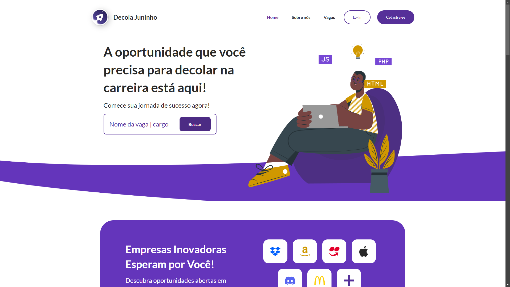
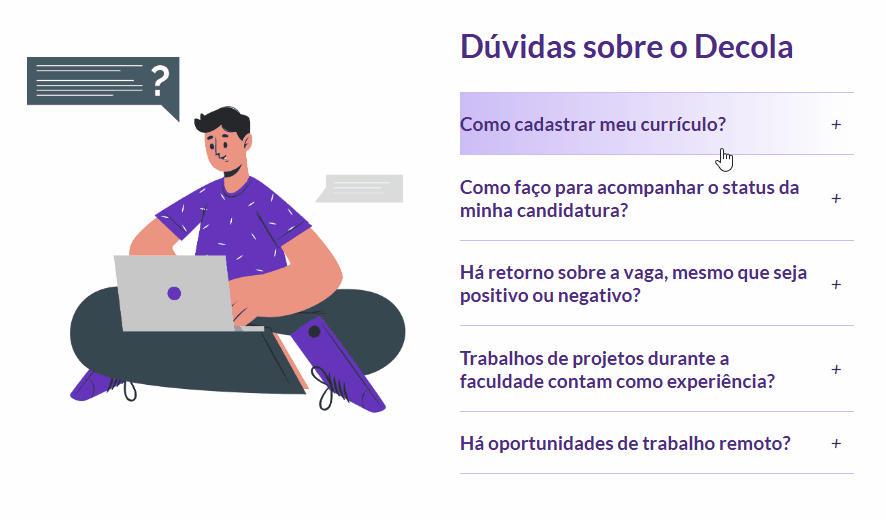

# Decola Juninho - Landing Page with HTML | CSS | JS

## Summary

- [Project](#project)
- [Images](#images)
- [Author](#author)

## Project

The project is a landing page from Decola Juninho, that has the objectives:

- Create the web application being guided by Figma Layout
- Add functionality of FAQs question to open and close the questions
- Add functionality of Feedbacks carousel to slide the feedbacks
- Create a responsive layout for mobile and desktop screen

[Figma layout](https://www.figma.com/design/9bPWYGgaQKkqWDZjWetnyU/Workspace---Decola-Juninho?node-id=29-3&p=f&t=8XqPiAr3Yua7XK2n-0)

## Images

### FAQs Functionality

### Mobile Responsive Layout

## Author

- GitHub - [Felipe Santiago Morais](https://github.com/SantiagoMorais)
- Linkedin - [Felipe Santiago](https://www.linkedin.com/in/felipe-santiago-873025288/)
- Instagram - [@felipe.santiago.morais](https://www.instagram.com/felipe.santiago.morais)
- Email - <a href="mailto:contatofelipesantiago@gmail.com" target="blank">contatofelipesantiago@gmail.com</a>
